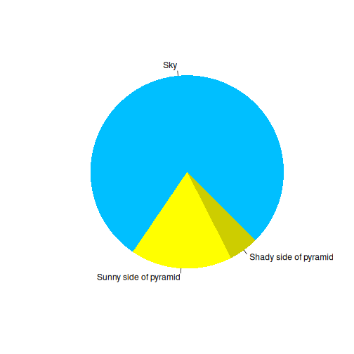

:::::::::::::::::::::::::::::::::::::: questions 

- How do you write a lesson using R Markdown and `{sandpaper}`?

::::::::::::::::::::::::::::::::::::::::::::::::

::::::::::::::::::::::::::::::::::::: objectives

- Explain how to use markdown with the new lesson template
- Demonstrate how to include pieces of code, figures, and nested challenge blocks

::::::::::::::::::::::::::::::::::::::::::::::::

## Introduction

This is a lesson created via The Carpentries Workbench. It is written in
[Pandoc-flavored Markdown](https://pandoc.org/MANUAL.txt) for static files and
[R Markdown][r-markdown] for dynamic files that can render code into output. 
Please refer to the [Introduction to The Carpentries 
Workbench](https://carpentries.github.io/sandpaper-docs/) for full documentation.

What you need to know is that there are three sections required for a valid
Carpentries lesson template:

 1. `questions` are displayed at the beginning of the episode to prime the
    learner for the content.
 2. `objectives` are the learning objectives for an episode displayed with
    the questions.
 3. `keypoints` are displayed at the end of the episode to reinforce the
    objectives.

:::::::::::::::::::::::::::::::::::::::::::::::::::::::::::::::::::: instructor

Inline instructor notes can help inform instructors of timing challenges
associated with the lessons. They appear in the "Instructor View"

::::::::::::::::::::::::::::::::::::::::::::::::::::::::::::::::::::::::::::::::

::::::::::::::::::::::::::::::::::::: challenge 

## Challenge 1: Can you do it?

What is the output of this command?

```r
paste("This", "new", "lesson", "looks", "good")
```

:::::::::::::::::::::::: solution 

## Output
 
```output
[1] "This new lesson looks good"
```

:::::::::::::::::::::::::::::::::


## Challenge 2: how do you nest solutions within challenge blocks?

:::::::::::::::::::::::: solution 

You can add a line with at least three colons and a `solution` tag.

:::::::::::::::::::::::::::::::::
::::::::::::::::::::::::::::::::::::::::::::::::

## Figures

You can also include figures generated from R Markdown:


``` r
pie(
  c(Sky = 78, "Sunny side of pyramid" = 17, "Shady side of pyramid" = 5), 
  init.angle = 315, 
  col = c("deepskyblue", "yellow", "yellow3"), 
  border = FALSE
)
```

<div class="figure" style="text-align: center">

<p class="caption">Sun arise each and every morning</p>
</div>

Or you can use standard markdown for static figures with the following syntax:

`{alt='alt text for
accessibility purposes'}`

{alt='Blue Carpentries hex person logo with no text.'}

::::::::::::::::::::::::::::::::::::: callout

Callout sections can highlight information.

They are sometimes used to emphasise particularly important points
but are also used in some lessons to present "asides": 
content that is not central to the narrative of the lesson,
e.g. by providing the answer to a commonly-asked question.

::::::::::::::::::::::::::::::::::::::::::::::::


## Math

One of our episodes contains $\LaTeX$ equations when describing how to create
dynamic reports with {knitr}, so we now use mathjax to describe this:

`$\alpha = \dfrac{1}{(1 - \beta)^2}$` becomes: $\alpha = \dfrac{1}{(1 - \beta)^2}$

Cool, right?


``` r
library(epidemics)

uk_pop <- population(
  name = "UK population",
  contact_matrix = matrix(1),
  demography_vector = 67e6,
  initial_conditions = matrix(
    c(0.9999, 0.0001, 0, 0),
    nrow = 1, ncol = 4
  )
)

uk_pop
```

``` output
<population> object
```

``` output

 Population name: 
```

``` output
"UK population"
```

``` output

 Demography 
Dem. grp. 1: 67,000,000 (100%)

 Contact matrix 
             Dem. grp. 1:
Dem. grp. 1:            1

 Initial Conditions 
       [,1]  [,2] [,3] [,4]
[1,] 0.9999 1e-04    0    0
```

## Widgets

You can also embed self-contained interactive HTML/JS widgets by reading
them in and emitting them as raw markup:

<!-- ============================================================
 Renewal-equation step-through widget — slide-deck style
 (unit-square incidence bars, pink highlight, cumulative red
 annotation lines, boxed final result — mirrors the existing
 slide deck's slide 19-24 pattern)

 Drop directly into intro-renewal-equation.Rmd after the renewal
 equation formula is introduced, before the worked "Case: t=2"
 example. Raw HTML passes through pandoc untouched.
============================================================= -->
<div class="rsw" id="rsw-1">
<div class="rsw-daypick" id="rsw1-daypick"></div>
<div class="rsw-panels">
<div class="rsw-panel">
<div class="rsw-panel-label">Incidence</div>
<div class="rsw-stacks" id="rsw1-inc"></div>
<div class="rsw-axis" id="rsw1-inc-axis"></div>
</div>
<div class="rsw-panel">
<div class="rsw-panel-label">Generation time &omega;(s)</div>
<div class="rsw-bars" id="rsw1-omega"></div>
<div class="rsw-axis" id="rsw1-omega-axis"></div>
</div>
</div>
<div class="rsw-notes" id="rsw1-notes"></div>
<div class="rsw-controls">
<button id="rsw1-prev">&larr; back</button>
<span id="rsw1-step-lbl">step 0 / 0</span>
<button id="rsw1-next">next &rarr;</button>
</div>
<div class="rsw-result" id="rsw1-result"></div>
</div>
<style>
  #rsw-1{ font-family: inherit; max-width: 660px; margin: 1.4em 0; padding: 18px 22px 20px;
    border: 1px solid #d8d8d8; border-radius: 6px; background: #fbfbfb; }
  #rsw-1 .rsw-daypick{ display:flex; gap:6px; margin-bottom:14px; flex-wrap:wrap; }
  #rsw-1 .rsw-daypick button{ font: inherit; font-size:0.82em; padding:4px 11px; border-radius:14px;
    border:1px solid #ccc; background:#fff; cursor:pointer; color:#444; }
  #rsw-1 .rsw-daypick button.on{ background:#333; color:#fff; border-color:#333; }
  #rsw-1 .rsw-panels{ display:grid; grid-template-columns:1fr 1fr; gap:18px; }
  #rsw-1 .rsw-panel-label{ font-size:0.75em; color:#777; text-transform:uppercase; letter-spacing:.04em; margin-bottom:6px; }
  #rsw-1 .rsw-stacks, #rsw-1 .rsw-bars{ display:flex; align-items:flex-end; gap:6px; height:110px; border-bottom:1px solid #ccc; }
  #rsw-1 .rsw-axis{ display:flex; gap:6px; margin-top:3px; }
  #rsw-1 .rsw-axis span{ flex:1; text-align:center; font-size:0.68em; color:#888; }
  #rsw-1 .stack-col{ flex:1; display:flex; flex-direction:column-reverse; gap:2px; align-items:center; }
  #rsw-1 .unit{ width:78%; height:11px; background:#555; border-radius:2px; }
  #rsw-1 .unit.hi{ background:#e8828a; }
  #rsw-1 .unit.dim{ background:#ddd; }
  #rsw-1 .bar-col{ flex:1; display:flex; flex-direction:column; align-items:center; }
  #rsw-1 .bar-col .fill{ width:78%; background:#8a5a2b; border-radius:2px 2px 0 0; align-self:flex-end; }
  #rsw-1 .bar-col.hi .fill{ background:#e8828a; }
  #rsw-1 .bar-col .fv{ font-size:0.68em; color:#666; margin-top:3px; }
  #rsw-1 .rsw-notes{ margin-top:14px; min-height:22px; }
  #rsw-1 .rsw-notes div{ color:#c0392b; font-size:0.86em; margin:8px 0; }
  #rsw-1 .rsw-eq{ color:#8a4a44; font-size:0.92em; margin-top:3px; padding-left:2px; opacity:0.85; }
  #rsw-1 .rsw-controls{ display:flex; align-items:center; gap:14px; margin-top:14px; padding-top:12px; border-top:1px dashed #ccc; }
  #rsw-1 .rsw-controls button{ font: inherit; font-size:0.85em; padding:5px 13px; border-radius:5px; border:1px solid #999; background:#fff; color:#444; cursor:pointer; }
  #rsw-1 .rsw-controls button:disabled{ opacity:.35; cursor:default; }
  #rsw-1 .rsw-controls span{ font-size:0.8em; color:#888; }
  #rsw-1 .rsw-result{ margin-top:12px; }
  #rsw-1 .rsw-result .box{ display:inline-block; border:1.5px solid #c0392b; color:#c0392b; border-radius:5px;
    padding:8px 14px; font-size:0.92em; background:#fdf1f0; }
  [data-bs-theme="dark"] #rsw-1{ border-color:#444; background:#242424; }
  [data-bs-theme="dark"] #rsw-1 .rsw-daypick button{ border-color:#555; background:#2a2a2a; color:#ddd; }
  [data-bs-theme="dark"] #rsw-1 .rsw-daypick button.on{ background:#eee; color:#222; border-color:#eee; }
  [data-bs-theme="dark"] #rsw-1 .rsw-panel-label{ color:#aaa; }
  [data-bs-theme="dark"] #rsw-1 .rsw-stacks, [data-bs-theme="dark"] #rsw-1 .rsw-bars{ border-bottom-color:#555; }
  [data-bs-theme="dark"] #rsw-1 .rsw-axis span{ color:#999; }
  [data-bs-theme="dark"] #rsw-1 .unit{ background:#999; }
  [data-bs-theme="dark"] #rsw-1 .unit.dim{ background:#444; }
  [data-bs-theme="dark"] #rsw-1 .unit.hi{ background:#e8828a; }
  [data-bs-theme="dark"] #rsw-1 .bar-col .fill{ background:#c99a6a; }
  [data-bs-theme="dark"] #rsw-1 .bar-col.hi .fill{ background:#e8828a; }
  [data-bs-theme="dark"] #rsw-1 .bar-col .fv{ color:#bbb; }
  [data-bs-theme="dark"] #rsw-1 .rsw-notes div{ color:#ff8c7f; }
  [data-bs-theme="dark"] #rsw-1 .rsw-eq{ color:#e0a49c; }
  [data-bs-theme="dark"] #rsw-1 .rsw-controls{ border-top-color:#444; }
  [data-bs-theme="dark"] #rsw-1 .rsw-controls button{ border-color:#666; background:#2a2a2a; color:#ddd; }
  [data-bs-theme="dark"] #rsw-1 .rsw-controls span{ color:#999; }
  [data-bs-theme="dark"] #rsw-1 .rsw-result .box{ border-color:#ff8c7f; color:#ff8c7f; background:#3a2422; }
</style>
<script>
(function(){
  var I = [5,7,4,3,10];          // I_1..I_5, matching the slide deck's worked example
  var W = [0.2,0.4,0.3,0.1];     // omega(1..4), matching the slide's own R5 = 10/4.8 = 2.08
  var maxI = Math.max.apply(null, I);
  var maxW = Math.max.apply(null, W);

  var t = 4;
  var step = 0; // 0 = nothing highlighted yet; step k highlights the k-th oldest active s

  var dayPick = document.getElementById("rsw1-daypick");
  [2,3,4,5].forEach(function(day){
    var b = document.createElement("button");
    b.textContent = "t = " + day;
    b.className = day === t ? "on" : "";
    b.addEventListener("click", function(){
      t = day; step = 0;
      Array.prototype.forEach.call(dayPick.children, function(c){ c.classList.remove("on"); });
      b.classList.add("on");
      render();
    });
    dayPick.appendChild(b);
  });

  function fmt(n){ return (Math.round(n*100)/100).toString(); }

  function activeSVals(){
    // order most recent -> oldest: s = 1, 2, ..., t-1
    // (starts with the latest contributing day, t-1, and steps backward in time)
    var arr = [];
    for(var s = 1; s <= t-1; s++) arr.push(s);
    return arr;
  }

  function render(){
    var sOrder = activeSVals();
    var maxStep = sOrder.length; // step==maxStep means fully revealed + result shown
    if(step > maxStep) step = maxStep;
    var revealed = sOrder.slice(0, step); // s-values revealed so far
    var currentS = step > 0 ? sOrder[step-1] : null; // only this step's pair gets highlighted

    // incidence panel: show I_1..I_{t-1} as columns (history) plus I_t highlighted separately? 
    // Slide style: show full incidence bars 1..t, highlight only the bar matching the CURRENT step's s.
    var incEl = document.getElementById("rsw1-inc");
    var incAxis = document.getElementById("rsw1-inc-axis");
    incEl.innerHTML = ""; incAxis.innerHTML = "";
    for(var day = 1; day <= t; day++){
      var val = I[day-1];
      var col = document.createElement("div");
      col.className = "stack-col";
      var isToday = day === t;
      var sOfDay = t - day;
      var isRevealed = sOfDay === currentS;
      for(var u = 0; u < val; u++){
        var unit = document.createElement("div");
        unit.className = "unit" + (isToday ? " dim" : (isRevealed ? " hi" : ""));
        col.appendChild(unit);
      }
      incEl.appendChild(col);
      var axLbl = document.createElement("span");
      axLbl.textContent = isToday ? "t" : ("t\u2212" + sOfDay);
      incAxis.appendChild(axLbl);
    }

    // omega panel: bars s=1..t-1, highlight only the CURRENT step's s
    var omEl = document.getElementById("rsw1-omega");
    var omAxis = document.getElementById("rsw1-omega-axis");
    omEl.innerHTML = ""; omAxis.innerHTML = "";
    for(var s = 1; s <= 4; s++){
      var w = W[s-1];
      var active = s <= (t-1);
      var col2 = document.createElement("div");
      col2.className = "bar-col" + (active && s === currentS ? " hi" : "");
      var fillH = (w/maxW*100).toFixed(0);
      col2.innerHTML = '<div class="fv">'+(active? w.toFixed(2):'')+'</div><div class="fill" style="height:'+(active?fillH:0)+'px; opacity:'+(active?1:0.15)+';"></div>';
      col2.style.opacity = active ? 1 : 0.3;
      omEl.appendChild(col2);
      var axLbl2 = document.createElement("span");
      axLbl2.textContent = active ? ("s="+s) : "";
      omAxis.appendChild(axLbl2);
    }
    // fix bar heights (they need px against 90px scale)
    Array.prototype.forEach.call(omEl.querySelectorAll(".fill"), function(f, idx){
      var s = idx+1; var w = W[s-1];
      f.style.height = (w/maxW*90) + "px";
    });

    // notes: cumulative red annotation lines
    var notesEl = document.getElementById("rsw1-notes");
    notesEl.innerHTML = "";
    revealed.forEach(function(s){
      var day = t - s;
      var Iv = I[day-1], Wv = W[s-1];
      var line = document.createElement("div");
      line.innerHTML =
        'Infections from day ' + day + ' (I<sub>' + day + '</sub>=' + Iv + ') have a ' + Wv.toFixed(2) + ' probability of causing a new infection today.' +
        '<div class="rsw-eq">I(t\u2212' + s + ')\u00d7\u03c9(' + s + ')&nbsp; = &nbsp;I<sub>' + day + '</sub>\u00d7\u03c9(' + s + ')&nbsp; = &nbsp;' +
        Iv + '\u00d7' + Wv.toFixed(2) + '&nbsp; = &nbsp;<b>' + (Iv*Wv).toFixed(2) + ' infectious individuals</b></div>';
      notesEl.appendChild(line);
    });

    // controls
    document.getElementById("rsw1-prev").disabled = step === 0;
    document.getElementById("rsw1-next").disabled = step === maxStep;
    document.getElementById("rsw1-step-lbl").textContent = "step " + step + " / " + maxStep;

    // result box only on final step
    var resultEl = document.getElementById("rsw1-result");
    if(step === maxStep){
      var sum = 0, terms = [];
      sOrder.forEach(function(s){
        var day = t - s;
        var prod = I[day-1]*W[s-1];
        sum += prod;
        terms.push("I<sub>" + day + "</sub>\u00d7\u03c9(" + s + ")");
      });
      var Rt = I[t-1]/sum;
      resultEl.innerHTML = '<div class="box">Delay-adjusted R<sub>'+t+'</sub> = I<sub>'+t+'</sub> / (' + terms.join(' + ') + ') = ' + I[t-1] + ' / ' + fmt(sum) + ' = <b>' + fmt(Rt) + '</b></div>';
    } else {
      resultEl.innerHTML = "";
    }
  }

  document.getElementById("rsw1-prev").addEventListener("click", function(){ if(step>0){ step--; render(); } });
  document.getElementById("rsw1-next").addEventListener("click", function(){ step++; render(); });

  render();
})();
</script>

Here's another one, for a different worked example:

<!-- ============================================================
 CFR delay-adjustment step-through widget — slide-deck style
 (unit-square incidence bars, pink highlight, cumulative red
 annotation lines, boxed naive/underestimation/adjusted results —
 mirrors the existing slide deck's slide 25-34 pattern)

 Drop directly into intro-cfr-adjust-delays.Rmd after D_t and u_t
 are defined in the "Unbiased CFR" section, before the "Day 0 /
 Day 1 / Day 2" worked walkthrough. Raw HTML passes through
 pandoc untouched.
============================================================= -->
<div class="csw" id="csw-1">
<div class="csw-daypick" id="csw1-daypick"></div>
<div class="csw-panels">
<div class="csw-panel">
<div class="csw-panel-label">Incidence, by day of onset</div>
<div class="csw-stacks" id="csw1-inc"></div>
<div class="csw-axis" id="csw1-inc-axis"></div>
</div>
<div class="csw-panel">
<div class="csw-panel-label">Onset-to-death f(s)</div>
<div class="csw-bars" id="csw1-f"></div>
<div class="csw-axis" id="csw1-f-axis"></div>
</div>
<div class="csw-panel">
<div class="csw-panel-label">Deaths, by day of death</div>
<div class="csw-stacks" id="csw1-deaths"></div>
<div class="csw-axis" id="csw1-deaths-axis"></div>
</div>
</div>
<div class="csw-notes" id="csw1-notes"></div>
<div class="csw-controls">
<button id="csw1-prev">&larr; back</button>
<span id="csw1-step-lbl">step 0 / 0</span>
<button id="csw1-next">next &rarr;</button>
</div>
<div class="csw-result" id="csw1-result"></div>
</div>
<style>
  #csw-1{ font-family: inherit; max-width: 660px; margin: 1.4em 0; padding: 18px 22px 20px;
    border: 1px solid #d8d8d8; border-radius: 6px; background: #fbfbfb; }
  #csw-1 .csw-daypick{ display:flex; gap:6px; margin-bottom:14px; flex-wrap:wrap; }
  #csw-1 .csw-daypick button{ font: inherit; font-size:0.82em; padding:4px 11px; border-radius:14px;
    border:1px solid #ccc; background:#fff; cursor:pointer; color:#444; }
  #csw-1 .csw-daypick button.on{ background:#333; color:#fff; border-color:#333; }
  #csw-1 .csw-panels{ display:grid; grid-template-columns:1fr 1fr 1fr; gap:14px; }
  #csw-1 .unit.death{ background:#7a3b3b; }
  #csw-1 .csw-panel-label{ font-size:0.75em; color:#777; text-transform:uppercase; letter-spacing:.04em; margin-bottom:6px; }
  #csw-1 .csw-stacks, #csw-1 .csw-bars{ display:flex; align-items:flex-end; gap:6px; height:110px; border-bottom:1px solid #ccc; }
  #csw-1 .csw-axis{ display:flex; gap:6px; margin-top:3px; }
  #csw-1 .csw-axis span{ flex:1; text-align:center; font-size:0.68em; color:#888; }
  #csw-1 .csw-subnote{ font-size:0.72em; color:#999; margin-top:6px; text-align:center; }
  #csw-1 .stack-col{ flex:1; display:flex; flex-direction:column-reverse; gap:2px; align-items:center; }
  #csw-1 .unit{ width:78%; height:11px; background:#555; border-radius:2px; }
  #csw-1 .unit.hi{ background:#e8828a; }
  #csw-1 .unit.dim{ background:#ddd; }
  #csw-1 .bar-col{ flex:1; display:flex; flex-direction:column; align-items:center; }
  #csw-1 .bar-col .fill{ width:78%; background:#8a5a2b; border-radius:2px 2px 0 0; align-self:flex-end; }
  #csw-1 .bar-col.hi .fill{ background:#e8828a; }
  #csw-1 .bar-col .fv{ font-size:0.68em; color:#666; margin-top:3px; }
  #csw-1 .csw-notes{ margin-top:14px; min-height:22px; }
  #csw-1 .csw-notes div{ color:#c0392b; font-size:0.86em; margin:8px 0; }
  #csw-1 .csw-eq{ color:#8a4a44; font-size:0.92em; margin-top:3px; padding-left:2px; opacity:0.85; }
  #csw-1 .csw-controls{ display:flex; align-items:center; gap:14px; margin-top:14px; padding-top:12px; border-top:1px dashed #ccc; }
  #csw-1 .csw-controls button{ font: inherit; font-size:0.85em; padding:5px 13px; border-radius:5px; border:1px solid #999; background:#fff; color:#444; cursor:pointer; }
  #csw-1 .csw-controls button:disabled{ opacity:.35; cursor:default; }
  #csw-1 .csw-controls span{ font-size:0.8em; color:#888; }
  #csw-1 .csw-result{ margin-top:12px; display:flex; gap:10px; flex-wrap:wrap; }
  #csw-1 .csw-result .box{ display:inline-block; border:1.5px solid #c0392b; color:#c0392b; border-radius:5px;
    padding:8px 14px; font-size:0.9em; background:#fdf1f0; }
  [data-bs-theme="dark"] #csw-1{ border-color:#444; background:#242424; }
  [data-bs-theme="dark"] #csw-1 .csw-daypick button{ border-color:#555; background:#2a2a2a; color:#ddd; }
  [data-bs-theme="dark"] #csw-1 .csw-daypick button.on{ background:#eee; color:#222; border-color:#eee; }
  [data-bs-theme="dark"] #csw-1 .csw-panel-label{ color:#aaa; }
  [data-bs-theme="dark"] #csw-1 .csw-stacks, [data-bs-theme="dark"] #csw-1 .csw-bars{ border-bottom-color:#555; }
  [data-bs-theme="dark"] #csw-1 .csw-axis span{ color:#999; }
  [data-bs-theme="dark"] #csw-1 .csw-subnote{ color:#999; }
  [data-bs-theme="dark"] #csw-1 .unit{ background:#999; }
  [data-bs-theme="dark"] #csw-1 .unit.dim{ background:#444; }
  [data-bs-theme="dark"] #csw-1 .unit.hi{ background:#e8828a; }
  [data-bs-theme="dark"] #csw-1 .unit.death{ background:#c97b7b; }
  [data-bs-theme="dark"] #csw-1 .bar-col .fill{ background:#c99a6a; }
  [data-bs-theme="dark"] #csw-1 .bar-col.hi .fill{ background:#e8828a; }
  [data-bs-theme="dark"] #csw-1 .bar-col .fv{ color:#bbb; }
  [data-bs-theme="dark"] #csw-1 .csw-notes div{ color:#ff8c7f; }
  [data-bs-theme="dark"] #csw-1 .csw-eq{ color:#e0a49c; }
  [data-bs-theme="dark"] #csw-1 .csw-controls{ border-top-color:#444; }
  [data-bs-theme="dark"] #csw-1 .csw-controls button{ border-color:#666; background:#2a2a2a; color:#ddd; }
  [data-bs-theme="dark"] #csw-1 .csw-controls span{ color:#999; }
  [data-bs-theme="dark"] #csw-1 .csw-result .box{ border-color:#ff8c7f; color:#ff8c7f; background:#3a2422; }
</style>
<script>
(function(){
  var c = [5,7,4,3];             // c_0..c_3, cases by onset day, matching the slide deck
  var d = [1,1,3,2];              // deaths by day of death (daily incidence, one per day).
                                  // NOTE: the source Rmd and slides only ever give the
                                  // *cumulative* D_t; showing deaths as a day-by-day
                                  // incidence series (mirroring the cases panel) is a
                                  // pedagogical addition for this widget, not from the source.
                                  // This is an illustrative synthetic series, not tied to
                                  // the source's worked-example figures.
  var f = [0.2,0.4,0.3,0.1];     // f_0..f_3, matching the slide deck
  var F = []; f.reduce(function(acc,v,i){ F[i]=acc+v; return acc+v; }, 0);
  var cumC = []; c.reduce(function(acc,v,i){ cumC[i]=acc+v; return acc+v; }, 0);
  var cumD = []; d.reduce(function(acc,v,i){ cumD[i]=acc+v; return acc+v; }, 0);
  var maxC = Math.max.apply(null, c);
  var maxF = Math.max.apply(null, f);

  var t = 2;
  var step = 0;

  var dayPick = document.getElementById("csw1-daypick");
  [0,1,2,3].forEach(function(day){
    var b = document.createElement("button");
    b.textContent = "t = " + day;
    b.className = day === t ? "on" : "";
    b.addEventListener("click", function(){
      t = day; step = 0;
      Array.prototype.forEach.call(dayPick.children, function(c2){ c2.classList.remove("on"); });
      b.classList.add("on");
      render();
    });
    dayPick.appendChild(b);
  });

  function fmt(n){ return (Math.round(n*100)/100).toString(); }

  function activeIVals(){
    // reveal order oldest onset day first: i = 0,1,...,t (matches slide walkthrough order,
    // which starts from the day with the *smallest* cumulative delay weight narrative... 
    // the source slides reveal newest-influencing-day first (c_t) then step outward;
    // we mirror that: i = t, t-1, ..., 0
    var arr = [];
    for(var i = t; i >= 0; i--) arr.push(i);
    return arr;
  }

  function render(){
    var order = activeIVals();
    var maxStep = order.length;
    if(step > maxStep) step = maxStep;
    var revealed = order.slice(0, step);
    var currentI = step > 0 ? order[step-1] : null; // only this step's day gets highlighted

    // incidence panel: columns for day 0..t
    var incEl = document.getElementById("csw1-inc");
    var incAxis = document.getElementById("csw1-inc-axis");
    incEl.innerHTML = ""; incAxis.innerHTML = "";
    for(var i = 0; i <= t; i++){
      var val = c[i];
      var col = document.createElement("div");
      col.className = "stack-col";
      var isRevealed = i === currentI;
      for(var u = 0; u < val; u++){
        var unit = document.createElement("div");
        unit.className = "unit" + (isRevealed ? " hi" : "");
        col.appendChild(unit);
      }
      incEl.appendChild(col);
      var axLbl = document.createElement("span");
      axLbl.textContent = "day " + i;
      incAxis.appendChild(axLbl);
    }

    // deaths panel: columns for day 0..t, same axis as incidence
    var deathsEl = document.getElementById("csw1-deaths");
    var deathsAxis = document.getElementById("csw1-deaths-axis");
    deathsEl.innerHTML = ""; deathsAxis.innerHTML = "";
    for(var di = 0; di <= t; di++){
      var dval = d[di];
      var dcol = document.createElement("div");
      dcol.className = "stack-col";
      for(var du = 0; du < dval; du++){
        var dunit = document.createElement("div");
        dunit.className = "unit death";
        dcol.appendChild(dunit);
      }
      if(dval === 0){
        // keep column height consistent even with zero deaths
        dcol.style.minHeight = "11px";
      }
      deathsEl.appendChild(dcol);
      var daxLbl = document.createElement("span");
      daxLbl.textContent = "day " + di;
      deathsAxis.appendChild(daxLbl);
    }

    // f panel: bars s=0..3, highlight only the CURRENT day's own cumulative range 0..(t-currentI)
    var fEl = document.getElementById("csw1-f");
    var fAxis = document.getElementById("csw1-f-axis");
    fEl.innerHTML = ""; fAxis.innerHTML = "";
    var currentDelay = currentI === null ? -1 : (t - currentI);
    for(var s = 0; s <= 3; s++){
      var val2 = f[s];
      var col2 = document.createElement("div");
      col2.className = "bar-col" + (s <= currentDelay ? " hi" : "");
      fEl.appendChild(col2);
      var fillWrap = document.createElement("div");
      fillWrap.className = "fv";
      fillWrap.textContent = val2.toFixed(2);
      col2.appendChild(fillWrap);
      var fill = document.createElement("div");
      fill.className = "fill";
      fill.style.height = (val2/maxF*90) + "px";
      col2.appendChild(fill);
      var axLbl2 = document.createElement("span");
      axLbl2.textContent = "s=" + s;
      fAxis.appendChild(axLbl2);
    }

    // notes
    var notesEl = document.getElementById("csw1-notes");
    notesEl.innerHTML = "";
    revealed.forEach(function(i){
      var delay = t - i;
      var ci = c[i], Fv = F[delay];
      var line = document.createElement("div");
      line.innerHTML =
        'Cases with onset on day ' + i + ' (c<sub>' + i + '</sub>=' + ci + ') have a ' + Fv.toFixed(2) + ' probability their outcome is known by day ' + t + '.' +
        '<div class="csw-eq">c(i)\u00d7F(t\u2212i)&nbsp; = &nbsp;c<sub>' + i + '</sub>\u00d7F(' + delay + ')&nbsp; = &nbsp;' +
        ci + '\u00d7' + Fv.toFixed(2) + '&nbsp; = &nbsp;<b>' + (ci*Fv).toFixed(2) + ' cases with known outcome</b></div>';
      notesEl.appendChild(line);
    });

    document.getElementById("csw1-prev").disabled = step === 0;
    document.getElementById("csw1-next").disabled = step === maxStep;
    document.getElementById("csw1-step-lbl").textContent = "step " + step + " / " + maxStep;

    var resultEl = document.getElementById("csw1-result");
    if(step === maxStep){
      var sum = 0, terms = [];
      order.forEach(function(i){
        var delay = t - i;
        var prod = c[i]*F[delay];
        sum += prod;
        terms.push('c<sub>' + i + '</sub>\u00d7F(' + delay + ')');
      });
      var Dt = cumD[t], Ct = cumC[t];
      var bt = Dt/Ct, pt = Dt/sum;
      resultEl.innerHTML =
        '<div class="box">Naive CFR (b<sub>'+t+'</sub>) = D<sub>'+t+'</sub>/C<sub>'+t+'</sub> = ' + Dt + '/' + Ct + ' = <b>' + fmt(bt) + '</b><br>' +
        'Adjusted CFR (p<sub>'+t+'</sub>) = D<sub>'+t+'</sub> / (' + terms.join(' + ') + ') = ' + Dt + ' / ' + fmt(sum) + ' = <b>' + fmt(pt) + '</b></div>';
    } else {
      resultEl.innerHTML = "";
    }
  }

  document.getElementById("csw1-prev").addEventListener("click", function(){ if(step>0){ step--; render(); } });
  document.getElementById("csw1-next").addEventListener("click", function(){ step++; render(); });

  render();
})();
</script>

Because these files are pulled in with `readLines()` rather than parsed as
lesson source, sandpaper's build cache keys off this `.Rmd` file, not the
HTML/JS file it reads. If you edit `renewal-slidestyle-widget.html` or
`cfr-slidestyle-widget.html` and the preview doesn't show your changes, run
`sandpaper::reset_site()` before rebuilding to force a full re-render.

::::::::::::::::::::::::::::::::::::: keypoints

- Use `.md` files for episodes when you want static content
- Use `.Rmd` files for episodes when you need to generate output
- Run `sandpaper::check_lesson()` to identify any issues with your lesson
- Run `sandpaper::build_lesson()` to preview your lesson locally

::::::::::::::::::::::::::::::::::::::::::::::::

[r-markdown]: https://rmarkdown.rstudio.com/
